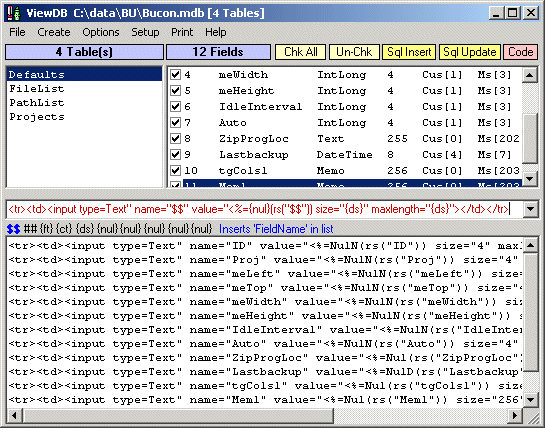



## ViewDB \- Access VB/ASP Coding Donkey

### Description

This is a One Form One Ini solution to the frustration of writing repetitive VB/ADO/ASP Database code. I hope you will find this extremely useful for certain tasks, and a sound concept for improved coding and tailoring to individual requirements. As I can't live without it now - so I thought I would share it.

(1) Opens any Access 97/2000 Database and Lists Tables, Fields, Types.

(2) Type one line of code, program will replicate the line using the

correct Fieldnames/Numbers/Types and Sizes - ASP programmers dream.

(3) Create a choice of connection strings based on the Open database.

(4) Create Sql INSERT, UPDATE & SELECT statments with actual field names.

(5) Print your output code, or Double Click Ouputbox to send to clipboard.

(6) Split Screen to adjust to preferred ListBox v Outputbox areas.

(7) Most settings saved, return to where you were when restarting.

(8) MRU File List, Auto-Open last database, Synchronized Clipboard etc.

(9) Tool Tips explain most items, can be turned off when desired.

(10) Reminder bar shows current User Keys, DblClick to turn off.

(11) Disconnected Recordsets, freeing off DB during development.

(12) All Translation 'Keys' are user definable.

At the simplest level, Open a database and type in a template like -

MyArray(##) = rs("$$")

In the Ouputbox, ## and $$ get translated as FieldNumber and FieldName

MyArr(0) = rs("ID")

MyArr(1) = rs("qCode")

MyArr(2) = rs("Title")

MyArr(3) = rs("Lastname")

MyArr(4) = rs("firstname")

...........

........... and so on to n fields
 
### More Info
 

             |
---                |---
**Submitted On**   |2003-08-12 05:22:16
**By**             |[Ken Ashton](https://github.com/Planet-Source-Code/PSCIndex/blob/master/ByAuthor/ken-ashton.md)
**Level**          |Intermediate
**User Rating**    |5.0 (15 globes from 3 users)
**Compatibility**  |VB 6\.0
**Category**       |[Databases/ Data Access/ DAO/ ADO](https://github.com/Planet-Source-Code/PSCIndex/blob/master/ByCategory/databases-data-access-dao-ado__1-6.md)
**World**          |[Visual Basic](https://github.com/Planet-Source-Code/PSCIndex/blob/master/ByWorld/visual-basic.md)
**Archive File**   |[ViewDB1628188122003\.zip](https://github.com/Planet-Source-Code/ken-ashton-viewdb-access-vb-asp-coding-donkey__1-47631/archive/master.zip)

